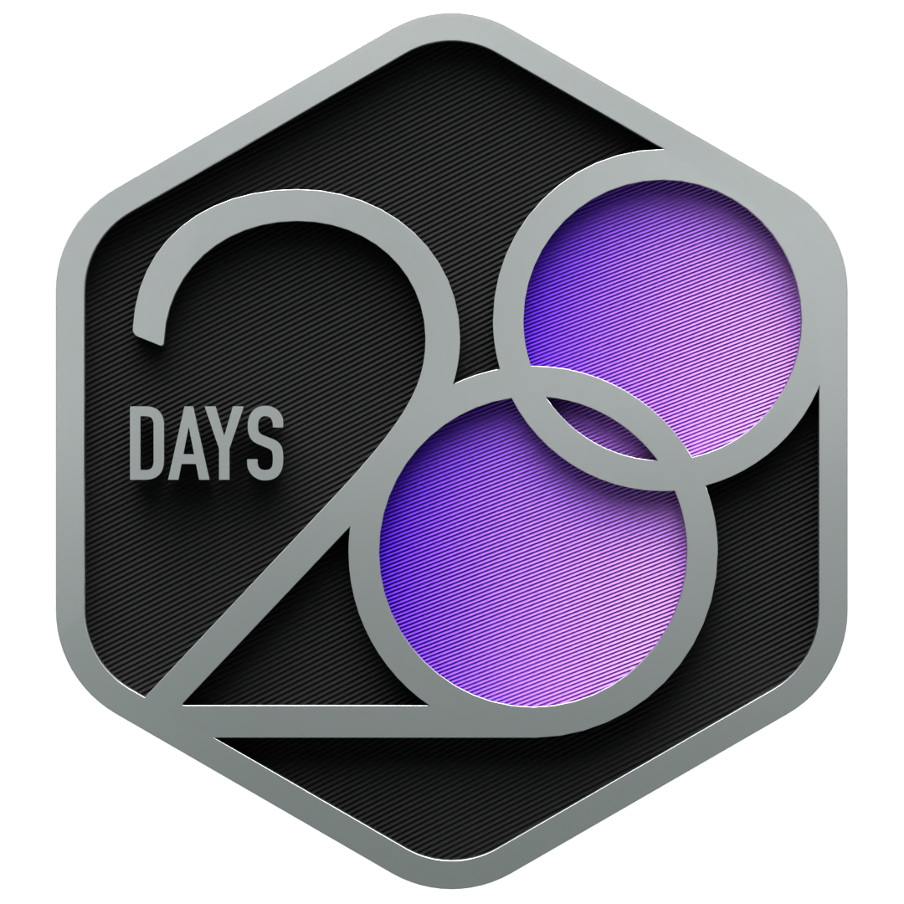
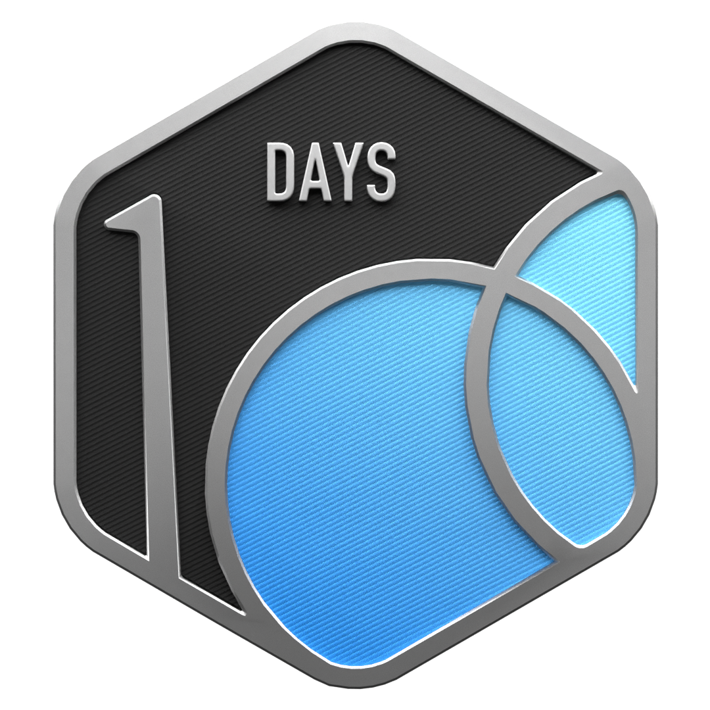

  

  

<h1 align="center">Hi 👋, I'm D Varun</h1>

<h3 align="center">
Backend Engineer | Java | Spring Boot
</h3>

Passionate about building scalable backend systems, modern APIs, and cloud-ready applications using Java and Spring Boot.

  
  

---

# 👨‍💻 About Me

- 💼 Software Engineer at Cognizant
- ☕ Building scalable backend applications with Java & Spring Boot
- 🏗️ Exploring distributed systems, system design, and cloud-native development
- 🚀 Passionate about clean architecture, REST APIs, and performance optimization

---

# 🛠 Tech Stack

---

## 📊 GitHub Statistics

  
  

---

## 🔥 GitHub Streak

  

---

## 📈 Contribution Activity

  

---

## 🏅 LeetCode Achievements

  
  
  

---

## 🚀 Featured Projects

---

## 📜 Certifications

---

## 🐍 Contribution Snake

  

---

Thanks for visiting! Feel free to explore my repositories and connect with me.

