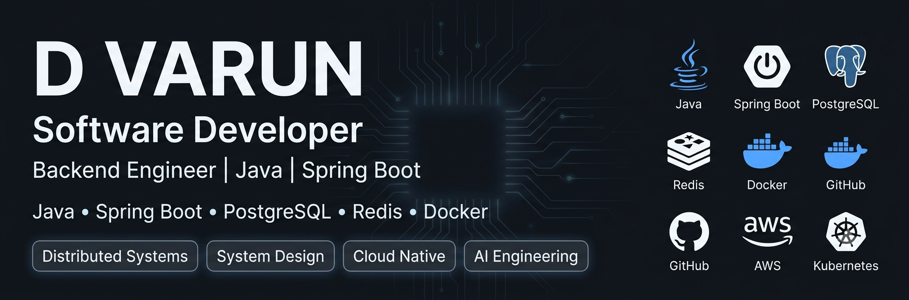

  

  

<h1 align="center">Hi 👋, I'm D Varun</h1>

<h3 align="center">
Software Engineer @ Cognizant
</h3>

Building scalable backend applications with Java, Spring Boot, Distributed Systems and AI.

  
  

---

# 👨‍💻 About Me

- 💼 Software Engineer @ Cognizant
- 🚀 Passionate about Backend Engineering
- 🌱 Currently learning Distributed Systems & Cloud
- ⚡ Interested in building scalable applications

---

# 🛠 Tech Stack

*Coming in the next step...*
